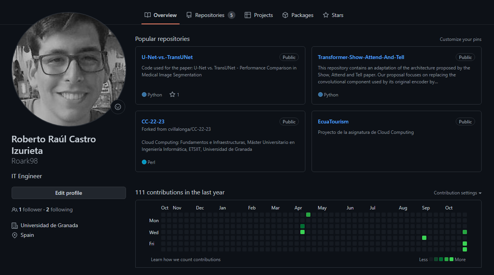
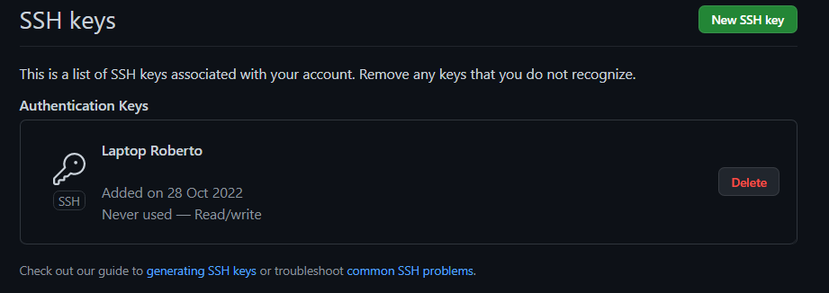

# 🔨 Configuración del repositorio 🔨

En esta sección se puede encontrar las actividades referentes a la configuración de git y Github correspondiente al hito 0 de la clase de Cloud Computing.

## Personalización del perfil de Github

Para este proyecto se está utilizando una cuenta de Github previamente creada, la cual ha sido personalizada para cumplir con los requerimientos propuestos por el hito en cuestión. Se reemplazó la imágen de perfil por defecto reemplazándola por una fotografía del autor, además colocando dentro de la biografía su lugar de residencia actual, además de profesión :muscle:.

## Creación del par de llaves SSH

Con el fin de poder manejar nuestros repositorios desde nuestro entorno local a través de git, se procede a generar un par de llaves ssh que serán utilizadas para verificar nuestra identidad con la plataforma de Github. Para llevar a cabo la generación de estas credenciales, dentro de nuestra consola empleamos el comando: `ssh-keygen -t ed25519 -C "email@gmail.com"`.

Habiendo generado la clave privada y pública dentro de la carpeta .ssh, ésta última procederemos a registrar dentro de nuestro perfil de Github. Dentro de `Perfil > Settings > SSH and GPG Keys > New SSH Key` añadiremos la correspondiente cadena de caracteres que nos permitirá enlazar nuestro equipo con la cuenta en cuestión.

