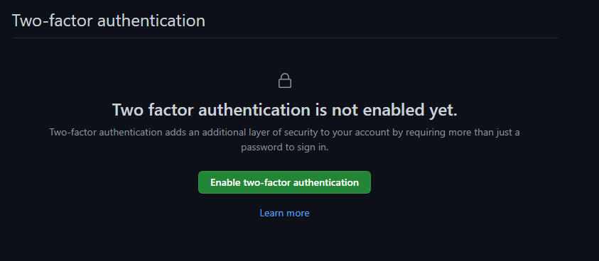
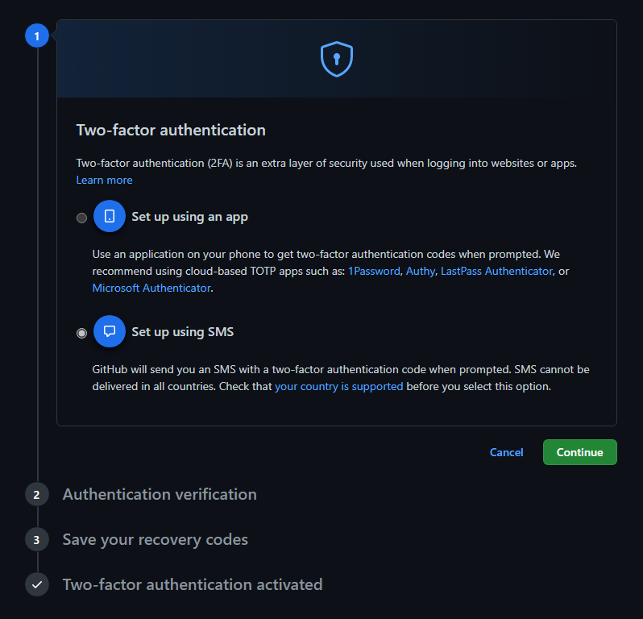

# :lock: Segundo Factor de Autenticación :lock:

Como medida adicional de seguridad, se decidió activar el sistema de autenticación de dos pasos ofrecido por la plataforma de Github. Para esto, se dene acceder a `Settings > Password and Authentication > Two-factor authentication`.

Una vez se active este sistema de autenticación adicional, para que éste inicie su función pedirá que se lleve a cabo ya sea mediante una app movil, o a través de verificación mediante mensaje SMS. 

Para este proyecto, se decidió optar por el segundo método mencionado. De esta manera, a continuación la plataforma solicita el número de teléfono junto con la extensión del país correspondiente. Posterior al ingreso del código de verificación enviado por Github, el proceso de autenticación en dos pasos se encontrará activado.
