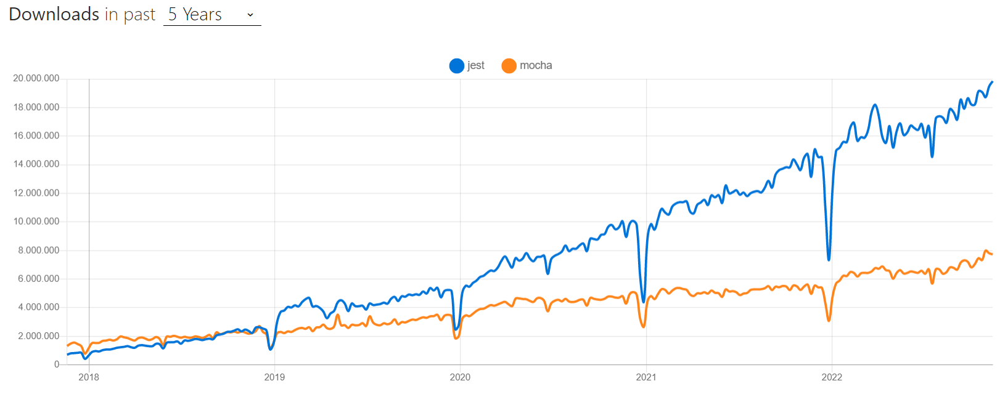

# Hito 2

## Testing framework

Para este apartado, se contaban principalmente con 2 grandes contendientes: Mocha y Jest. 

Con el fin de tomar decidir cuál usar, un buen criterio a tomar en cuenta es, sin duda, la popularidad de estas herramientas a lo largo del tiempo. Tomando en consideración el número de descargas en los últimos 5 años, se puede percibir claramente la imparable superioridad de Jest por encima de su rival. Esto, desde luego, significa también que más empresas en general están adoptando Jest como su framework de testeo, por lo que el decantarnos por esta alternativa nos permitiría asemejarnos mucho más al entorno laboral actual.

Basándonos ahora en lo que ambos marcos ofrecen, podemos observar que Mocha debe ser obligatoriamente acompañado por una biblioteca de aserciones (algo que incluso este hito toma en consideración). Para esto, la práctica más común es acompañarlo con la biblioteca de aserciones Chai. Si bien, esto no tiene nada de malo, suele ser valorable el requerir el menor número de dependencias posibles, por lo que, dado que Jest ya incorpora un sistema de aserciones, no requerimos un módulo adicional de esta naturaleza.

Adicionalmente, Jest nos permite generar un reporta referente a la cobertura del código (code coverage ratio) registrado durante el testing. Esto se consigue únicamente empleando el flag `--coverage` de Jest, mientra que en el caso de Mocha, esto es posible de obtener, pero nuevamente haciendo uso de una biblioteca adicional.

Por estas razones, y con el fin de no elevar considerablemente la complejidad del proyecto, se ha decidido optar por Jest como marco de pruebas.

## Biblioteca de aserciones

Como ya se dijo en el apartado anterior, el rol de biblioteca de aserciones será tomado también por Jest, al éste ya contar con sistema de aserciones incorporadas bastadas en 'expect()'

## Gestor de tareas

Pese a ser realmente confeccionado como un gestor de paquetes, `npm` ha sido elegido como gestor de tareas para el presente proyecto. Gracias a los npm scripts, se permiten definir tareas mediante un sistema de alias definidos en el archivo package.json del proyecto. Al tomar esta decisión, nos evitamos añadir dependencias como Grunt o Gulp encargadas de cumplir con esta función.

Adicionalmente, en caso de trabajar con tecnologías nuevas, o que hayan sido modificadas de manera drástica, tanto Grunt como Gulp no contarán con los plugins adecuados para trabajar con éstas. Debido a esto, al usar estos gestores de tareas, dependemos directamente de los autores de los plugins en caso de que querramos utilizar herramientas modernas o nuevas versiones. Por el contrario, al utilizar npm, nos ahorramos esa capa de abstracción adicional y podemos directamente consumir el paquete deseado.

De manera preliminar, las tareas que podrán ejecutarse a través del gestor npm serán:
- `npm install`: Permite instalar todas las dependencias que se encuentren listadas en el archivo package.json
- `npm start`: Inicia el respectivo servidor
- `npm run test`: Ejecuta los tests descritos en los respectivos archivos de testing.
- `npm run dev`: Permite iniciar el servidor haciendo uso de la dependencia `nodemon`, vuelve a lanzar el servidor luego de que se haya modificado alguno de los ficheros del proyecto.
