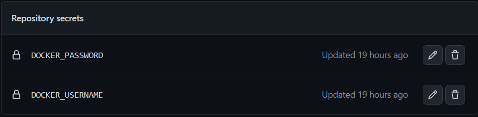
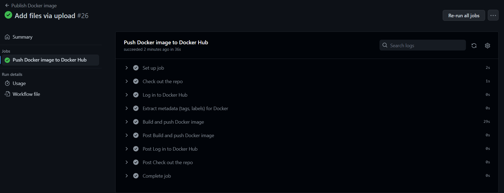
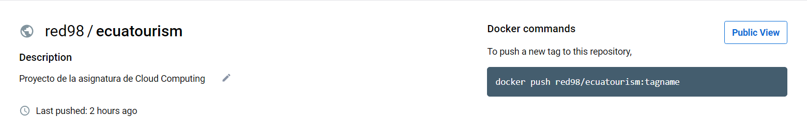
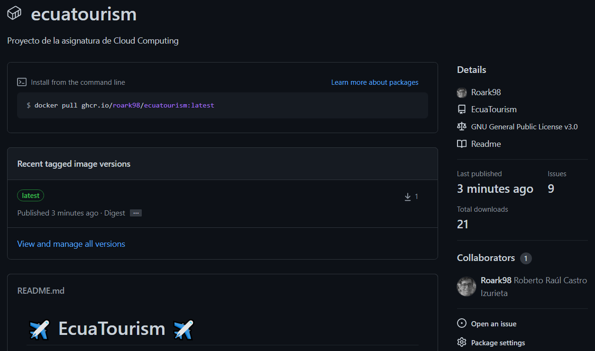

## Subida automática de imagen a DockerHub mediante Github Actions

Como primer paso, desde luego, es mandatorio contar con una cuenta en [DockerHub](https://hub.docker.com/), y crear un repositorio público donde albergar la imagen del proyecto. Una vez cumplido este requisito, procedemos con la confección de un *workflow* específico que aproveche los *webhooks* de Github Actions para la automatización del proceso de subida, el cual se puede consultar [aquí](https://github.com/Roark98/EcuaTourism/blob/main/.github/workflows/docker-upload.yml).

Este fichero se basó en el propio ejemplo recomendado en la [documentación](https://docs.github.com/en/actions/publishing-packages/publishing-docker-images) de Github, únicamente aplicando las configuraciones necesarias para ser adaptadas a nuestro caso particular.

Entre las consideraciones que fueron tomadas en consideración dentro del fichero, encontramos:

* De manera preliminar, la respectiva acción unicamente tendrá lugar cuando se reciba un push que afecte a la rama principal del repositorio. Este aspecto en un futuro cercano será reformado con el fin de evitar una ejecución excesivamente repetitiva de la acción.

```
on:
  push:
    branches: [ main ]
```

* Se define un paso correspondiente a la autenticación y acceso a la cuenta de DockerHub. Para que esto sea posible, se hace uso de variables de entorno encriptadas ofrecidas por Github, las cuales se conocen como *secrets*. Se definen dos de estas variables, siendo una dirigida a albergar el nombre de usuario de la cuenta de DockerHub, y otra para la contraseña.

```
name: Log in to Docker Hub
        uses: docker/login-action@f054a8b539a109f9f41c372932f1ae047eff08c9
        with:
          username: ${{ secrets.DOCKER_USERNAME }}
          password: ${{ secrets.DOCKER_PASSWORD }}
```

<p align='center'>

</p>

* En cuanto al paso referente a la metadata dentro del *workflow*, nos encontramos que al momento de publicar la imagen en DockerHub, ésta siempre será subida con el tag de *latest*, con el fin de que cualquier usuario que decida hacer un pull de nuestra imagen sin especificar el tag, éste reciba siempre la última versión disponible. Esto se hace debido a que, de no hacer esto, por defecto Github publicaría nuestra imagen usando el nombre de nuestro repositorio para el tag.

```
name: Extract metadata (tags, labels) for Docker
        id: meta
        uses: docker/metadata-action@98669ae865ea3cffbcbaa878cf57c20bbf1c6c38
        with:
          images: red98/ecuatourism
          tags: latest
```

Finalmente, una vez que se lleve a cabo un push, dentro del apartado de *Actions* podremos hacer seguimiento de la ejecución de cada uno de los pasos de nuestra acción, pudiendo finalmente contemplar en DockeHub nuestra imagen publicada en nuestro respectivo [repositorio](https://hub.docker.com/repository/docker/red98/ecuatourism) público.

<p align='center'>

</p>

<p align='center'>

</p>

## Publicación automática de imagen Docker en Github Container Registry

Github Container Registry es un servicio de Github que permite almacenar imágenes de contenedores dentro de nuestra cuenta en esta plataforma, además de permitir asociarl una imagen con un repositorio. Adicionalmente, también permite acceder a imágenes de contenedores públicos de forma anónima. Ciertamente este servicio es considerablemente similar a DockerHub, pero con algunos beneficios adicionales.
* Permite enlazar directamente una imagen a un repositorio, por lo que permite ofrecer directamente toda la documentación de la misma.
* Ofrece mayor libertad al momento de definir la visibilidad que tendrá nuestra imagen.
* Se habilitan distintas funcionalidades para restringir el uso de una imagen tanto dirigido para repositorios como para usuarios (muy útil para restringir usos cuando se desarrolla para una organización cerrada).

Por estos motivos, pese a que no se desea despreciar a una plataforma tan utilizada como DockerHub, Github Container Registry representa una herramienta especialmente útil cuando se piensa a nivel de empresa.

Con el fin de poder publicar nuestra imagen de forma automática a este servicio, se ha optado por nuevamente apoyarnos en un *workflow* de Github Actions que, por el momento, subirá nuestra imagen después de cada commit que se registre en nuestro repositorio de Github.

La estructura de este [fichero](https://github.com/Roark98/EcuaTourism/blob/main/.github/workflows/docker-registry.yml) replica en su mayoría al utilizado para la publicación automática en DockerHub. Principalmente, estos dos *workflows* difieren en el paso de login.

Por obvias razones, se reemplaza la conexión a DockerHub, usando ahora en su lugar un paso de autenticación a Github Container Registry. Gracias a que para esta plataforma se usan las mismas credenciales que para la autenticación en Github, se pueden aprovechar las variables de entorno `github.actor` y `secrets.GITHUB_TOKEN` para el usuario y contraseña respectivamente.

```
name: Login to GitHub Container Registry
        uses: docker/login-action@v1
        with:
          registry: ghcr.io
          username: ${{ github.actor }}
          password: ${{ secrets.GITHUB_TOKEN }}
```

De esta forma, una vez que un push sea recibido en la rama principal, podemos observar la correcta publicación automática de la respectiva imagen dentro de los *packages* asociados a este repositorio.

<p align='center'>

</p>
