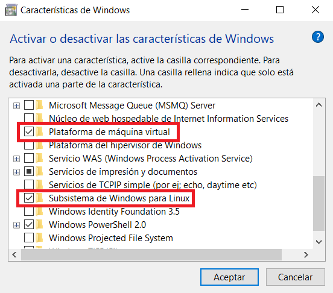
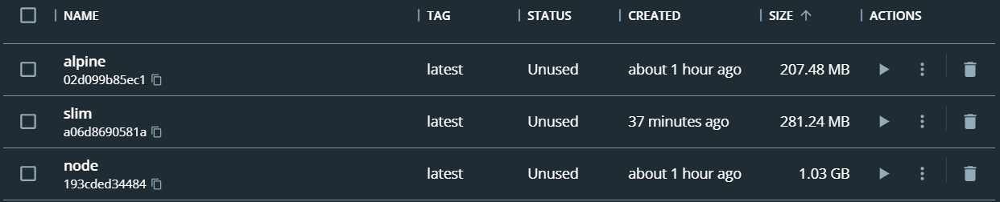

## Consideraciones previas
Desde luego, antes de hablar sobre decisiones relacionadas con contenedores primero requeriremos disponer de Docker en nuestro equipo. Al ser este proyecto desarrollado en Windows 10, el disponer de esta herramienta no basta únicamente con la descarga e instalación de la misma desde su [página oficial](https://www.docker.com/). En concreto, nos apoyaremos en el subsistema de Windows para Linux (WSL2) para poder utilizar Docker. Dicho kernel de linux puede obtenerse directamente desde la página de [Microsoft](https://learn.microsoft.com/en-us/windows/wsl/install-manual#step-4---download-the-linux-kernel-update-package).

Adicionalmente, debemos asegurarnos de contar con las características `Plataforma de máquina virtual` y `Subsistema de Windows para Linux`.

## Elección de imagen base para creación de contenedor Docker

Al momento de elaborar nuestro fichero Dockerfile, la imagen resultante de éste deberá basarse en una previamente creada. Teniendo esto en consideración, la decisión a tomarse se basará principalmente en el lenguaje y entorno de ejecución definido en hitos anteriores. De esta manera, surgen tres potenciales candidatos que permiten la instanciación de contenedores con node ya incorporado.

* Node:version - Ésta corresponde a la imagen oficial confeccionada por node, la cual ofrece de todas las dependencias necesaria junto con el gestor de paquetes npm. Destaca por ser una opción completa, con soporte para un amplio abanico de versiones, a parte de usualmente ser tomada como referencia por aquellos programadores que se inician en Docker. Cabe mencionar las más de 400 dependencias que presenta, por lo que por defecto se contarán con herramientas como wget, git o curl.
* Node:alpine - Al igual que la alternativa anterior, esta imagen provee del entorno de node pre-instalado, con la diferencia de que se apoya en Alpine Linux, una distribución considerablemente ligera de Linux. Además de ahorra espacio gracias a la elección previamente mencionada, también la reducida cantidad de dependencias y paquetes promueven una imagen ligera.
* Node:slim - Muy similar a node:alpine, esta imagen ofrece un entorno node de tamaño considerablemente reducido, pero esta vez a la mínima expresión. Esta imagen apoyada en Debian provee las herramientas estrictamente necesarias para el funcionamiento del entorno de ejecución.

Debido a que se busca el desarrollo de un proyecto considerablemente sencillo, y al ver que las tres opciones cumplen con permitir la ejecución de código en el lenguaje seleccionado, se decidió profundizar más en los requerimientos de espacio de cada uno, para así decantarnos por el más ligero.

Después de utilizar los tres distintos candidatos para la elaboración de la imagen de nuestro proyecto, se puede apreciar un considerable ahorro de recursos al optar por aquella apoyada en la distribución Alpine Linux. A esto, se le suma que dicha alternativa es destacada por múltiples [autores](https://snyk.io/blog/choosing-the-best-node-js-docker-image/) por presentar el menor número de vulnerabilidades.

Una vez tomada la decisión referente a la imagen base, podemos proceder a elaborar nuestro fichero [Dockerfile](https://github.com/Roark98/EcuaTourism/blob/main/docs/hito_3/dockerfile-creation.md).
