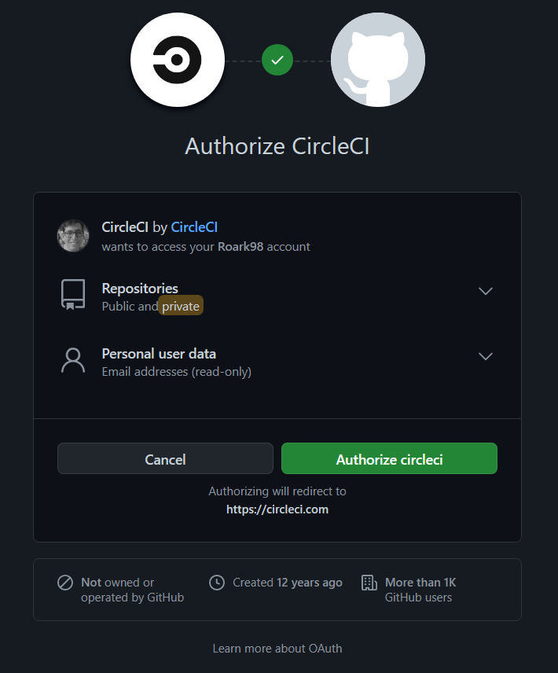
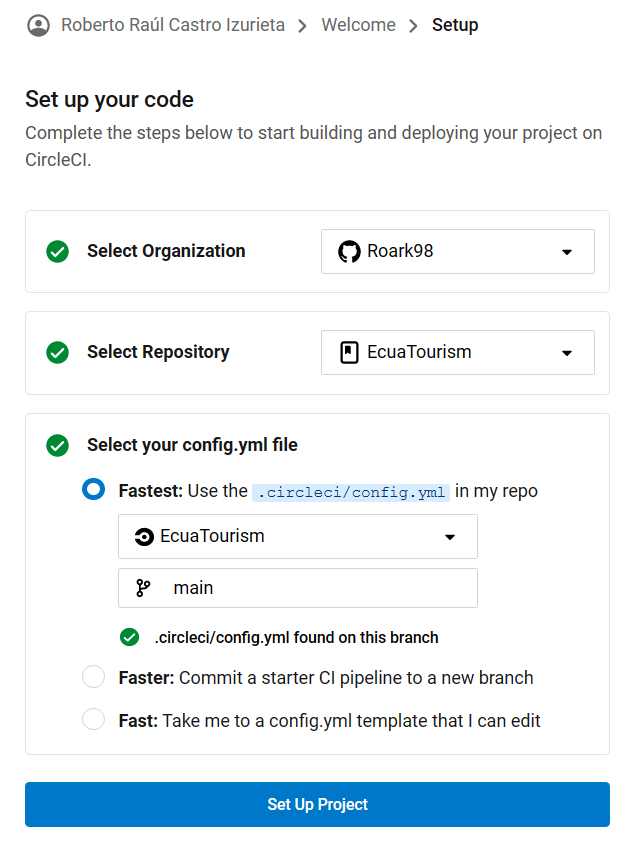
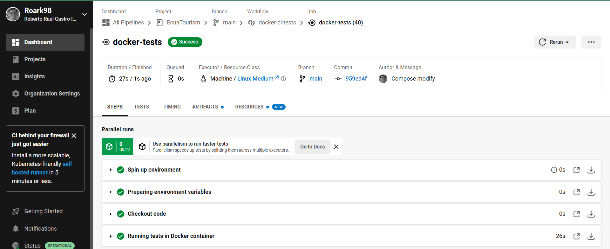

## Configuración y uso de CircleCI

Una vez elegido CircleCI como nuestro sistema de integración continua, procedemos a incorporarlo en nuestro proyecto.
El primer paso sería el crearnos una cuenta dentro del portal web de CircleCI.

El registro dentro de la plataforma permite también llevarse a cabo mediante nuestra cuenta de Github. Evidentemente esta acción sería la recomendada, con el fin de simplificar futuros pasos durante el proceso del registro.

<p align='center'>

</p>

Posteriormente, se nos solicita la cuenta de Github a la cual enlazaremos nuestro perfil de CircleCI. Gracias al paso anterior, este campo se autocompleta, además de mostrarse todos los repositorios presentes en nuestra cuenta.

Para finalizar con esta pantalla, se debe especificar la rama de la cuál el sistema de integración continua estará obteniendo los ficheros, además de ofrecernos distintos tipos de alternativas para la creación y uso del fichero de configuración para el proyecto. En este caso, buscando la mayor simpleza posible, se optó por la opción `Fastest`, ya que previamente se había creado el fichero requerido dentro del directorio `.circleci`.

<p align='center'>

</p>

Con esto, ya habríamos terminado con la plataforma para integración continua y pasaríamos a la elaboración del archivo de configuración.
Dentro de este, al menos a priori, se especifica una única tarea con el nombre `docker-tests` a llevarse a cabo en una máquina virtual construida a partir de una distribución de ubuntu. Adicionalmente, para esta máquina virtual se fija la cantidad de recursos a `medium`, ya que no requerimos mayores requerimientos computacionales como los que ofrecer CircleCI por defecto. Y finalmente, al definir los pasos de esta tarea, bajo el nombre `Running tests in Docker container`, especificamos la ejecución del comando `docker-compose up --abort-on-container-exit`. Esta forma de lanzar nuestros test es debido a que, como se ha mencionado en hitos anteriores, el proyecto se apoya en nodejs y PostgreSQL para el desarrollo de la API, por lo que realmente un contenedor con cada uno de estas tecnologías estarán trabajando al mismo tiempo para ofrecer el servicio de interés. Todo esto se realiza y detalla mediante el fichero `docker-compose.yml`.


```
version: 2.1

jobs:
  docker-tests:
    machine:
      image: ubuntu-2204:2022.04.2
    resource_class: medium
    steps:
      - checkout
      - run:
          name: "Running tests in Docker container"
          command: docker-compose up --abort-on-container-exit

workflows:
  docker-ci-tests:
    jobs:
      - docker-tests
```

Finalmente, al realizar un commit dentro de nuestro repositorio, al dirigirnos a nuestro panel de control dentro de la aplicación web de CircleCI, podemos encontrarnos con la situación actual de nuestro proyecto. Se puede llevar un control de cada una de las tareas definidas dentro de nuestro fichero `config.yml`, terminando con la ejecución de los tests.

<p align='center'>

</p>
