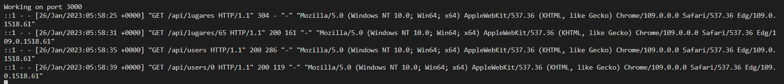

# Diseño de la API

Una vez elegido Express como framework para el desarrollo de nuestra API, podemos proceder a la elaboración de nuestras rutas buscando dar respuesta a las historias de usuario que fijamos al inicio del proyecto.

Dentro de nuestro sistema se diferencias dos distintos recursos, por un lado los lugares turísticos, y por otro los usuarios que formarán parte del sistema e interactuarán con el mismo. A continuación, se detallan las rutas implementadas para cada uno de éstos, junto con detalles respecto a su naturaleza y respuestas.

## Recurso: Lugar
Ruta | Metodo | Códigos de estado | Issue | Descripción
---|---|---|---|---
/ | GET | 200, 400 | <a href="https://github.com/Roark98/EcuaTourism/issues/1">[HU1]</a> | Despliega todos los lugares turísticos
/ | POST | 201, 400, 409 | <a href="https://github.com/Roark98/EcuaTourism/issues/4">[HU4]</a> | Permite crear un lugar nuevo
/:id | GET | 200, 400, 404 | <a href="https://github.com/Roark98/EcuaTourism/issues/3">[HU3]</a>, <a href="https://github.com/Roark98/EcuaTourism/issues/5">[HU5]</a> | Recupera un lugar turístico a partir de su id
/:id | PUT | 200, 400, 404 | <a href="https://github.com/Roark98/EcuaTourism/issues/4">[HU4]</a> | Permite actualizar un lugar que coincida con el id especificado
/:id | DELETE | 200, 404 | <a href="https://github.com/Roark98/EcuaTourism/issues/4">[HU4]</a> | Elimina un lugar dado su id
/type/:type | GET | 200, 400, 404 | <a href="https://github.com/Roark98/EcuaTourism/issues/2">[HU2]</a> | Retorna los lugares turísticos del tipo especificado
/city/:city | GET | 200, 400, 404 | <a href="https://github.com/Roark98/EcuaTourism/issues/2">[HU2]</a> | Devuelve los registros coincidentes con la ciudad dada
/region/:region | GET | 200, 400, 404 | <a href="https://github.com/Roark98/EcuaTourism/issues/2">[HU2]</a> | Devuelve los registros coincidentes con la region dada

Para este caso, se cubren las operaciones CRUD más básicas debido a que este proyecto podría responder a un catálogo de búsqueda de sitios turísticos ecuatorianos. Cabe recalcar que para la ruta `/:id` bajo el método `GET`, cada vez que se acceda a ésta, el sistema aumentará en una unidad las visitas que registra el sitio consultado. 

## Recurso: Usuario

Ruta | Metodo | Código de estado | Issue | Descripción
---|---|---|---|---
/ | GET | 200, 400 | <a href="https://github.com/Roark98/EcuaTourism/issues/4">[HU4]</a> | Retorna los usuarios presentes en el sistema
/:id | GET | 200, 400, 404 | <a href="https://github.com/Roark98/EcuaTourism/issues/4">[HU4]</a> | Retorna la información del usuario segun su id
/register | POST | 201, 400, 409 | <a href="https://github.com/Roark98/EcuaTourism/issues/4">[HU4]</a>, <a href="https://github.com/Roark98/EcuaTourism/issues/6">[HU6]</a> | Permite el registro del usuario
/login | POST | 200, 400, 404 | <a href="https://github.com/Roark98/EcuaTourism/issues/4">[HU4]</a>, <a href="https://github.com/Roark98/EcuaTourism/issues/6">[HU6]</a> | Permite validar el email y contraseña para realizar el login
/favorites/:id | PUT | 200, 400, 404 | <a href="https://github.com/Roark98/EcuaTourism/issues/6">[HU6]</a> | Permite al usuario actualizar la lista de favoritos dado su id

En cuanto al recurso usuario, se cubren las necesidades esperables de registro y login, tomando en consideración el uso del framework `bcryptjs` el cual permite cifrar las contraseñas ingresadas mediante la ruta `/register` en la base de datos. Adicionalmente, se considera una ruta `/favorites/:id` que permita al usuario actualizar su lista de identificadores de lugares favoritos.

# Tests añadidos
En adición a los tests unitarios elaborados en hitos anteriores, con la incorporación de estas rutas se decidió añadir funciones de testing a nivel de endpoint mediante el framework `supertest`. Se dedicó un fichero de testing separado tanto para el recurso [Lugar](https://github.com/Roark98/EcuaTourism/blob/main/api/tests/lugares.test.js) como [Usuario](https://github.com/Roark98/EcuaTourism/blob/main/api/tests/users.test.js). El objetivo en ambos ficheros es comprobar si para las situaciones planteadas se corresponden tanto las respuestas en formato `json` como los código de estado. Tanto las pruebas de estos dos ficheros como las pruebas unitarias pueden ejecutarse en conjunto mediante el comando `npm run test` definido dentro del fichero `packege.json`.

# Framework para manejo de logs
Finalmente, para el manejo de logs en nodejs se cuenta con una gran variedad de posibilidades. Encontramos frameworks altamente configurables como `winston`, o de gran rendimiento como `pino` o `bunyan`, no obstante, se decidió optar por una alternativa minimalista, reducida y que ofrezca solo la información más relevante conforme se visitan las rutas de la API. Por este motivo, nos hemos decantado por `morgan`, el cual es ampliamente utilizado para hacer seguimiento de solicitudes HTTP. Puede ser instalado mediante `npm`, y puede ser incluído en el proyecto tan solo con el comando `app.use(morgan('combined'))`. 

Como se observa, tan solo con las configuraciones por defecto en su modo `combined`, nos ofrece información en tiempo real tanto de las rutas visitadas, los códigos de estado retornados, etc.
