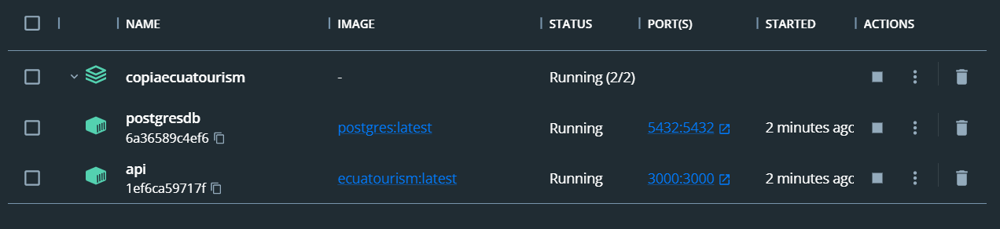
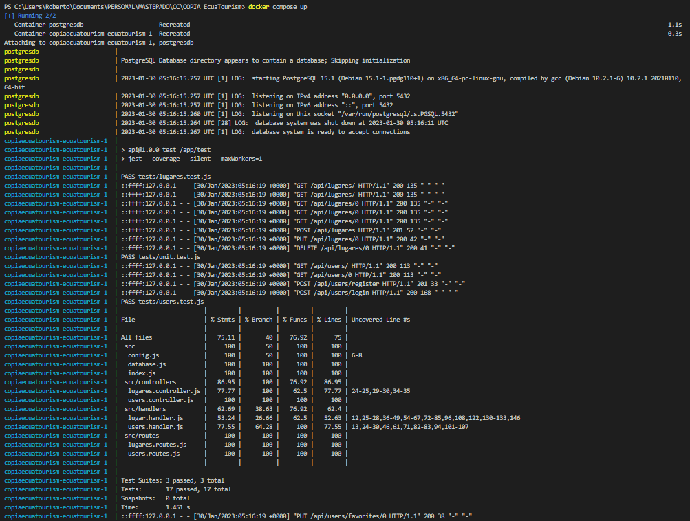
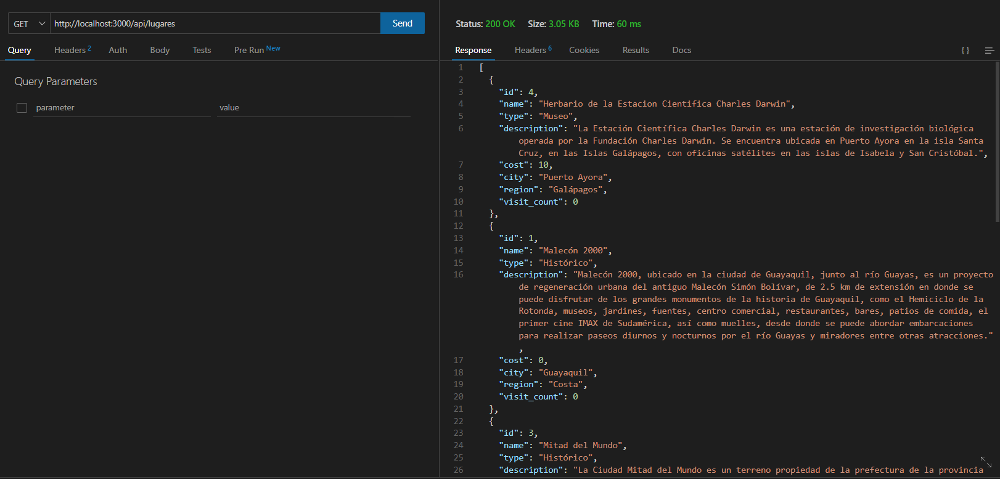
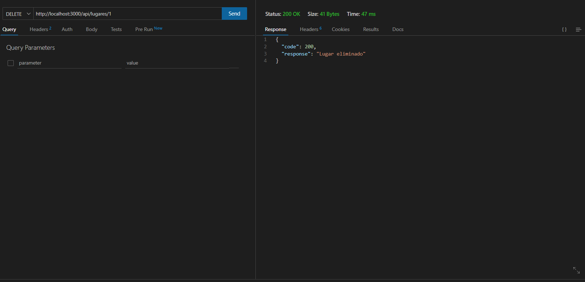

# Estructura del cluster y configuración de los contenedores
Con el fin de elaborar una aplicación que haga uso de múltiples microservicios dentro de un entorno cloud, nos hacemos de la herramienta `docker-compose` con el objetivo de orientarnos a un inminente despliegue.

El cluster a utilizar se compone de dos contenedores:
* Contenedor API | `ecuatourism`: Servidor web con la aplicación desplegada.
  * Se realiza un mapero del puerto 3000 interno del contenedor hacia un puerto 3000 externo
  * Se definen variables de entorno que permitan el correcto acceso a la base de datos

* Contenedor DATABASE | `db`: Base de datos PostgreSQL
  * Lleva a cabo un mapeo del puerto 5432 interno a un puerto 5432 externo
  * Se definen variables de entorno para la contraseña y nombre de la base de datos
  * Se especifica el uso de los ficheros `database.sql` y `file.sql`, los cuales contienen los querys necesarios para creacion de tablas e ingreso de registros de prueba respectivamente.

Dado que por defecto se genera un volumen persistente para la base de datos, pese a que los contenedores sean detenidos, registros almacenados dentro de la base de datos no son perdidos al reiniciar la aplicación.

```
version: '3.5'
services:
  db:
    container_name: postgresdb
    image: postgres
    restart: always
    ports:
      - 5432:5432
    environment:
      POSTGRES_PASSWORD: 1379
      POSTGRES_DB: ecuatourism
    volumes: 
      - ./api/database/database.sql:/docker-entrypoint-initdb.d/database.sql
      - ./api/database/file.sql:/docker-entrypoint-initdb.d/file.sql

  ecuatourism:
    container_name: api
    build: .
    image: ecuatourism
    ports:
      - "3000:3000"
    depends_on:
      - db
    environment:
      - DB_USER=postgres
      - DB_PASSWORD=1379
      - DB_HOST=db
      - DB_PORT=5432
      - DB_DATABASE=ecuatourism
```

# Despliegue y pruebas de funcionamiento

Como se puede observar en la siguiente imagen, al ejecutar el comando `docker compose up`, la respectiva aplicación procede a desplegarse dentro de nuestro entorno local, generándose los contenedores tanto para nuestra API, como para la base de datos.

<p align='center'>

</p>

Para comprobar el correcto funcionamiento del cluster, primero se decidió ejecutar tanto los test unitarios como aquellos a nivel de endpoint que se definieron en hitos anteriores. Estos son ejecutados mediante el comando `npm run test`. Como se puede observar, la aplicación desplegada sigue cumpliendo con todos los tests que hemos venido respetando a lo largo del desarrollo.

<p align='center'>

</p>

A manera de complemento, la aplicación fue iniciada mediante el comando `npm start`, con el fin de poder interactuar directamente con nuestra API y realizar distintas peticiones. Aprovechando los registros que fueron ingresados mediante el fichero `file.sql`, podemos ver cómo a través de Thunderclient podemos recibir todos los sitios turísticos registrados mediante una petición del tipo `GET`.

<p align='center'>

</p>

Así mismo, nos es posible la eliminación de un registro a través de una petición del tipo `DELETE`, en este caso solicitando la eliminación del lugar con un identificador con valor de 0.

<p align='center'>

</p>
